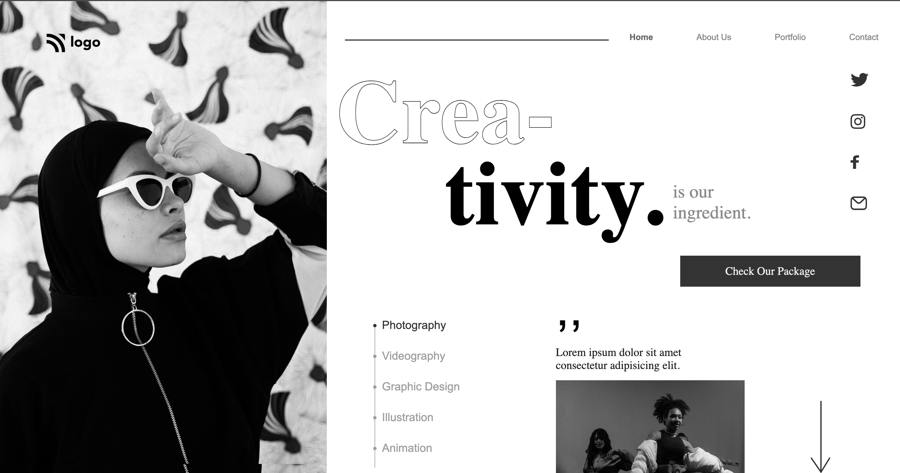

**Dance Homepage**
--------------------------------------
-----------------------------------------
   

[Deployed Link](https://dance-homepage-by-hs.netlify.app/)

What I learned from this Project?

- Learned how to use **HTML** and **CSS** to create a beautiful website.
- Implemented positioning using CSS grid.
- Implemented adding background color using linear-gradient property.
- Used CSS positioning property and flexbox property.
- Learned and implemented class, tag based selection of HTML elements.
- Implemented media queries to make the webpage responsive for other devices too.

